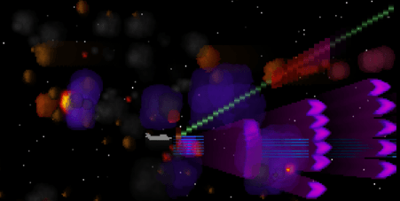

# TermAsteroids

_An Asteroids-like game, running in a terminal, written in PHP._



TermAsteroid is a horizontal scrolling [Asteroids](https://en.wikipedia.org/wiki/Asteroids_(video_game))-like game which has the following particularities:
- it runs in a terminal emulator.
- it is fully implemented in PHP (except for the alternative and optional rendering backend described below).
- it features 2 rendering backends (and can switch between the 2 at runtime):
  - one implemented in PHP.
  - one implemented in C and called through [FFI](https://www.php.net/manual/en/book.ffi.php).
- it highlights the benefits of:
  - using FFI in order to reimplement a tight loop, as long as it significantly outweighs the PHP / FFI communication overhead. This is the case here since the main data movement is between the renderer and PHP's output buffer. 
  - PHP's JIT for such (CPU-bound) application and especially how it boosts the PHP rendering backend, making it roughly 3 times faster.
  - PHP's cycle collector control functions which allow to disable it before entering a critical game loop and re-enable it later in non-critical parts.
- it renders early 90s style 2D graphics featuring:
  - 300x144 true color (24bpp) screen with a pixel change rate of (using kitty as terminal emulator):
    - 1.5+ MPixel/s with the PHP renderer.
    - 4+ MPixel/s with the PHP renderer and JIT enabled.
    - 9+ MPixel/s with the native renderer.
  - hundreds (500+) of animated sprites rendered per frame, with a sprite fill rate of:
    - 2+ MPixel/s (~500ns/pixel) with the PHP renderer.
    - 6+ MPixel/s (~167ns/pixel) with the PHP renderer and JIT enabled.
    - 30+ MPixel/s (~33ns/pixel) with the native renderer.
  - transparency, distortion and persistence effects.
  - procedural bitmap / animation generation via [Perlin noise](https://en.wikipedia.org/wiki/Perlin_noise).
  - pre-rendered sprite rotations.
  - adaptive performance in order to preserve a minimal framerate of 45 FPS:
    - non-gameplay objects (flames, smokes) reduction
    - color reduction & gradual dithering in replacement of transparency

## Requirements

- Linux
- Docker
- A fast terminal emulator with Unicode & true color support and an adjusted font size so that a maximized window will render at least 300 columns x 77 rows
  - [xterm](https://invisible-island.net/xterm/) meets these requirements and is embedded in the Docker image
  - [kitty](https://sw.kovidgoyal.net/kitty/) & [Alacritty](https://alacritty.org/) are recommended and must be already installed on your host since they are GPU-powered
  
## Getting started

### Install & run

```shell
git clone https://github.com/NoiseByNorthwest/term-asteroids.git
cd term-asteroids
make run
```

> The first `make run` execution will take some time (building the Docker image, warming up some caches...) before starting the game, but the next executions will start instantly.

### Uninstall

This command will remove the Docker containers and images, and will remove everything under `${PWD}/.tmp` 

```shell
make clean
```

## Terminal

### Default

By default, kitty will be used as terminal emulator if it is found on your host, otherwise xterm (installed in the Docker image) will be used.

### Forcing another terminal

Run one of these commands:

```shell
make select.term.xterm
make select.term.rxvt
make select.term.gnome-terminal
make select.term.kitty
make select.term.alacritty
```

And then:

```shell
make run
```

The best terminals for rendering speed are kitty and Alacritty. kitty is the best overall terminal since it also supports keyup event. 

## Controls

- **UP arrow** / **Numpad 8**: move the spaceship up
- **DOWN arrow** / **Numpad 5**: move the spaceship down
- **LEFT arrow** / **Numpad 4**: move the spaceship left
- **RIGHT arrow** / **Numpad 6**: move the spaceship right
- **p**: pause / resume
- **Esc** or **q**: quit
- **s**: reset

_N.B.: If the selected terminal is kitty, you will have a better experience using numpad keys to move the spaceship because keyup event is supported for these keys._

## Goals

Survive as long as possible:
- use the arrow keys to move the spaceship
- avoid collision with the asteroids
- collide with bonuses, they give one third of your health and improve one of your 3 weapons
- the fourth bonus, which is yellow, will not improve one of your weapons or increase your health, but rather give you few seconds of bullet time 

## Other running mode

Default mode (native renderer + JIT)

```shell
make run
```

Run it without JIT

```shell
make run.nojit
```

Run it with PHP renderer

```shell
make run.full_php
```

Run it with PHP renderer and without JIT

```shell
make run.full_php.no_jit
```
