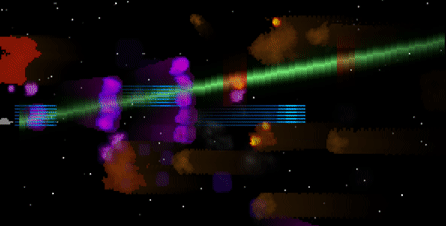

# TermAsteroids

_An Asteroids-like game, running in a terminal, written in PHP._



TermAsteroid is a horizontal scrolling [Asteroids](https://en.wikipedia.org/wiki/Asteroids_(video_game))-like game which has the following particularities:
- it runs in a terminal emulator.
- it is fully implemented in PHP (except for the alternative and optional rendering backend described below).
- it features 2 rendering backends (and can switch between the 2 at runtime):
  - one implemented in PHP.
  - one implemented in C and called through [FFI](https://www.php.net/manual/en/book.ffi.php).
- it highlights:
  - the benefit of using FFI in order to reimplement a tight loop, as long as it significantly outweighs the PHP / FFI communication overhead. This is the case here since the main data movement is between the renderer and PHP's output buffer. 
  - PHP's JIT benefits for such (CPU-bound) application and especially how it boosts the PHP rendering backend, making it 2 times faster and reducing the frame time by 40%.
  - PHP's cycle collector fairness for such application. Back in PHP 5 or even early PHP 7 versions, it was still a big issue for long-running processes with high load of object creations & destructions.  
- it renders early 90s style 2D graphics featuring:
  - 300x144 true color (24bpp) screen reaching 2+ million of pixel changes per second.
  - tens of animated medium/large sprites rendered per frame.
  - transparency, distortion and persistence effects.
  - procedural bitmap / animation generation via [Perlin noise](https://en.wikipedia.org/wiki/Perlin_noise).
  - pre-rendered sprite rotations.
  - adaptive performance in order to preserve a minimal framerate of 35 FPS.

## Requirements

- GNU/Linux distro
- Docker
- A fast terminal emulator with unicode & true color support and an adjusted font size so that a maximized window will render at least 300 columns x 77 rows
  - [xterm](https://invisible-island.net/xterm/) meets these requirements and is embedded in the Docker image
  
## Getting started

```shell
git clone https://github.com/NoiseByNorthwest/term-asteroids.git
cd term-asteroids
make run
```

> The first `make run` execution will take some time (building the Docker image, warming up some caches...) before starting the game, but the next executions will start instantly.

## Controls

- **UP arrow**: move the spaceship up
- **DOWN arrow**: move the spaceship down
- **LEFT arrow**: move the spaceship left
- **RIGHT arrow**: move the spaceship right
- **Esc** or **q**: quit
- **s**: reset

## Goals

Survive as long as possible:
- use the arrow keys to move the spaceship
- avoid collision with the asteroids
- collide with bonuses, they give one third of your health and improve one of your 3 weapons

## Other running mode

### Game modes

Default mode (native renderer + JIT)

```shell
make run
```

Run it without JIT

```shell
make run.nojit
```

Run it with PHP renderer

```shell
make run.full_php
```

Run it with PHP renderer and without JIT

```shell
make run.full_php.no_jit
```

### Dev mode

The dev mode gives nearly infinite health and more controls (see below). The difficulty level also increases faster. 

```shell
make run.dev
```

Additional controls:
- **r**: toggle renderer
- **a**: toggle adaptive performance
- **w**: show bounding and hit boxes
- **d**: increase blue laser's level
- **c**: decrease blue laser's level
- **f**: increase plasma ball's level
- **v**: decrease plasma ball's level
- **g**: increase energy beam's level
- **b**: decrease energy beam's level

## Benchmark

This game comes with a benchmark mode which allows to highlight the performance differences between the four optimization levels (PHP/native renderer combined with JIT on/off).

### Running it

To run all benchmark and generate the Markdown report:

```shell
make run.benchmark.all
```

### Results

PHP version: 8.2.6

CPU: Intel(R) Core(TM) i7-9850H CPU @ 2.60GHz

|                              |          Native Renderer + JIT |                Native Renderer |             PHP Renderer + JIT |                   PHP Renderer |
|------------------------------| ------------------------------ | ------------------------------ | ------------------------------ | ------------------------------ |
| Execution time               |                          20.4s |                          20.4s |                          20.4s |                          20.4s |
| Rendered frames              |                            777 |                            665 |                            614 |                            352 |
| Average frame time           |                         26.3ms |                         30.7ms |                         33.3ms |                         57.9ms |
| Average framerate            |                       38.1 FPS |                       32.6 FPS |                       30.1 FPS |                       17.3 FPS |
| Average gameplay+physic time |                          6.8ms |                         10.5ms |                          7.1ms |                         12.3ms |
| Average rendering time       |                         19.5ms |                         20.2ms |                         26.2ms |                         45.6ms |
| Average drawing time         |                          3.1ms |                          4.9ms |                          7.2ms |                         21.6ms |
| Average update time          |                          1.2ms |                          1.2ms |                          5.4ms |                         11.4ms |
| Average flushing time        |                         15.2ms |                         14.2ms |                         13.6ms |                         12.6ms |


Time breakdown explanation:
- frame time: the elapsed time between 2 frames (i.e. the inverse of frame rate). It is compound of gameplay+physic and rendering times.
- gameplay+physic time: this the time spent doing anything other than rendering the new frame, it mainly includes the gameplay & physic (moves, collisions) management.
- rendering time: this is the time spent for the new frame rendering, it is compound of drawing, update and flushing times.
- drawing time: the time spent drawing something (mainly bitmaps) to the frame buffer.
- update time: the time spent generating the stream of characters to the buffered output in order to update the terminal based screen.
- flushing time: the time spent flushing the output buffer. It may counterintuitively increase with a faster rendering loop since a faster rendering loop means a higher character changes throughput and thus more work for the terminal (and consequently a higher output blocking time).